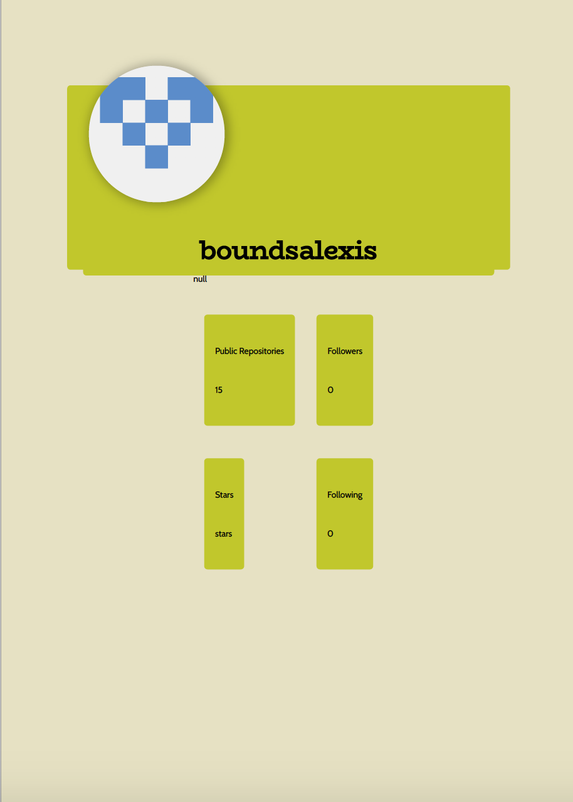

# Generate Profile
All weather all the time
 

# links
> [GitHub Repository](https://github.com/boundsalexis/generate-profile)


# Technologies Used
> Node JS
> GitHub API
> Electron
> Inquirer
>

# Summary
Check the weather for the week

# Code Snippet
``` javascript
async function start() {
    try{
        const answers = await promptUser(questions);
        const response= await apiCall(answers.github);
        const html = generateHTML(response,answers);
//cut straight from electron documentation 
        var conversion = convertFactory({
            converterPath: convertFactory.converters.PDF
          });
    
          conversion(html, function(err, result) {
            if (err) {
              return console.error(err);
            }
            let fileName= response.data.login + ".pdf";
                        result.stream.pipe(fs.createWriteStream(fileName));
            conversion.kill(); // necessary if you use the electron-server strategy, see bellow for details
          });
    } catch(err){
        console.log(err)
    }
}
```
> This was so helpful for learning how to use promises

## Authors

* **Alexis Bounds** 

- [Link to Portfolio Site](https://github.com/boundsalexis/basic-portfolio)
- [Link to Github](https://github.com/boundsalexiss)
- [Link to LinkedIn](https://www.linkedin.com/in/alexis-bounds-9b7711169/)